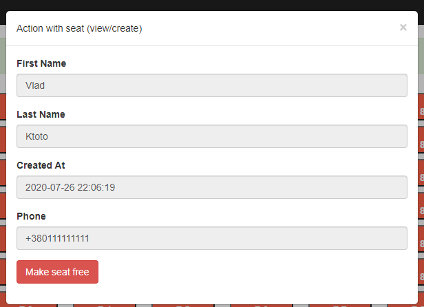

<p align="center">
    <h1 align="center">Theatre hall (test project)</h1>
    <br>
</p>

Task
------------
Есть кинотеатр размером 10x10. Изначально все места пустые. Нужно реализовать возможность сделать бронь места.

Данные, нужны для брони:
- имя
- фамилия
- номер телефона

При нажатии на уже забронированное место нужно вывести:
- дату и время бронирования
- данные человека, сделавшего бронь

Использовать:
- любой PHP фреймворк
- Бутстрап для шаблона
- код залить на Гит Хаб

Preview
------------


INSTALLATION
------------
Firstly up our virtual machine (ubuntu 18)
```
    @ vagrant up
```
Connect to machine via ssh
```
    @ vagrant ssh
```
After we need install and configure mysql
 - [Installing mysql](https://www.digitalocean.com/community/tutorials/mysql-ubuntu-18-04-ru)
 - Edit your php.ini file, it's located at /etc/php/[version]/apache2/php.ini and search for pdo_mysql you might found something like this

After that we need to restart server nginx (to make sure that mysql pdo loaded well)

```
service apache2 restart
```

Then create our database `test`
```
mysql -u root

<<< MYSQL
CREATE DATABASE test;
<<<
```

And in the end we must apply the migration
**(in root folder of project /app)**
```
php yii migrate/up
```
##Congrats!
#### [Create form] without data can't pass

#### [Create form] with valide data

#### [View form] shows occupied seat
